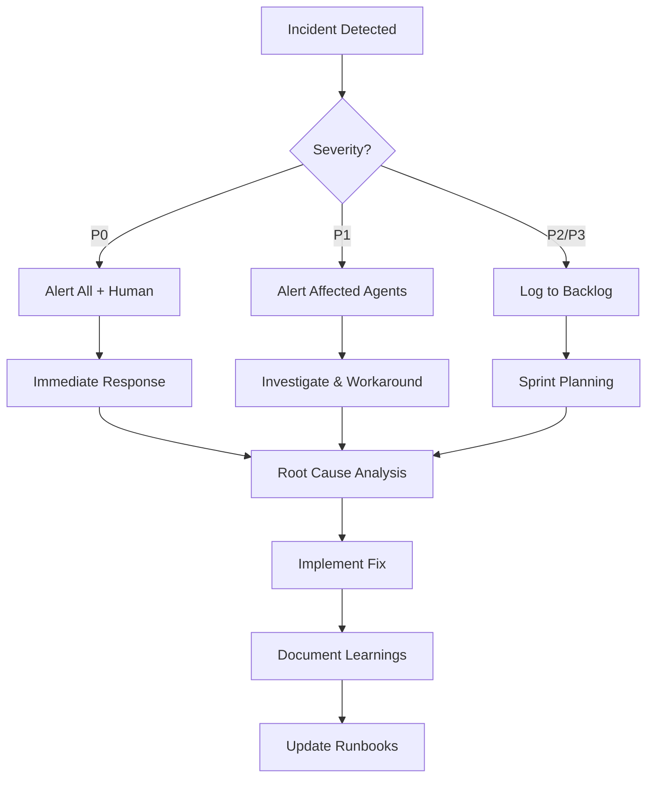

# Subagent Coordination Framework

## 🎯 Overview

This document defines the coordination framework for three specialized subagents working on the NFL analytics platform. Each agent has distinct responsibilities but must collaborate effectively to maintain system health, data quality, and research progress.

---

## 🤖 Agent Roster

| Agent | Primary Focus | Key Technologies | Communication Style |
|-------|--------------|------------------|---------------------|
| **DevOps** | Infrastructure & Reliability | Docker, PostgreSQL, Shell | Concise, alert-driven, status-focused |
| **ETL** | Data Pipelines & Quality | R, Python, SQL, APIs | Data-focused, validation-obsessed |
| **Research/Analytics** | Modeling & Academic Output | ML, Stats, R, Python, LaTeX | Academic, hypothesis-driven, rigorous |

---

## 🔄 Coordination Patterns

### 1. Daily Stand-Up (Async)

**Format**: Brief status update in shared log/channel

**DevOps Reports**:
- [ ] System health status (green/yellow/red)
- [ ] Overnight incidents or alerts
- [ ] Planned maintenance windows
- [ ] Resource utilization trends

**ETL Reports**:
- [ ] Pipeline execution summary (success/failure counts)
- [ ] Data freshness status
- [ ] API quota consumption
- [ ] Data quality issues discovered

**Research Reports**:
- [ ] Experiments running or completed
- [ ] Blockers or data needs
- [ ] Model performance updates
- [ ] Publication milestones

### 2. Weekly Planning

**Agenda**:
1. Review last week's metrics
2. Upcoming milestones and deadlines
3. Cross-agent dependencies
4. Technical debt or improvements
5. Resource allocation

**Typical Discussions**:
- ETL: "Week 10 data ready for models"
- Research: "Need opponent-level injury features"
- DevOps: "Database backup growing, need cleanup strategy"
- All: "Agree on priority: Model deployment vs. new features"

### 3. Sprint Retrospectives (Bi-Weekly)

**What Went Well**:
- Successful handoffs
- Performance improvements
- Lessons learned

**What Needs Improvement**:
- Communication gaps
- Process bottlenecks
- Technical challenges

**Action Items**:
- Process improvements
- Documentation updates
- Technical debt prioritization

---

## 📋 Handoff Checklist Templates

### Template: Data → Research Handoff

```yaml
# File: handoffs/YYYY-MM-DD_data_to_research.yaml

date: 2025-01-20
from: ETL Agent
to: Research Agent
trigger: features_dataset_updated

context:
  dataset_name: ""
  location: ""
  row_count: 0
  date_range: ""
  new_features: []
  breaking_changes: false
  data_quality_status: ""

validation:
  completeness: ""
  accuracy: ""
  freshness: ""
  report_location: ""

action_required:
  - ""

impact:
  models_affected: []
  retraining_needed: false
  backtest_rerun: false

notes: |
  Additional context...

acknowledged_by: ""
acknowledged_at: ""
```

### Template: Research → DevOps Deployment

```yaml
# File: handoffs/YYYY-MM-DD_research_to_devops_deploy.yaml

date: 2025-01-20
from: Research Agent
to: DevOps Agent
trigger: model_deployment_request

model_info:
  name: ""
  version: ""
  location: ""
  trained_on: ""
  
performance_metrics:
  validation_auc: 0.0
  test_roi: 0.0
  calibration_error: 0.0
  vs_baseline: ""

deployment_requirements:
  dependencies: []
  python_version: ""
  input_source: ""
  output_table: ""
  schedule: ""
  
monitoring:
  metrics_to_track: []
  alert_thresholds: {}
  comparison_baseline: ""

rollback_plan: |
  If performance degrades...

approved_by: "Research Agent"
deployed_by: ""
deployed_at: ""
production_status: "pending"
```

### Template: DevOps → ETL Infrastructure Change

```yaml
# File: handoffs/YYYY-MM-DD_devops_to_etl_infra.yaml

date: 2025-01-20
from: DevOps Agent
to: ETL Agent
trigger: infrastructure_change

change_type: "database_migration"  # or "schema_change", "performance_optimization", etc.

changes:
  migration_files: []
  affected_tables: []
  new_columns: []
  removed_columns: []
  breaking_changes: false

impact:
  performance_change: ""
  api_changes: false
  config_updates_needed: []

action_required:
  - "Update etl/config/schemas.yaml"
  - "Test pipelines in dev"
  - "Update validation rules"

testing_checklist:
  - [ ] Schema validation passes
  - [ ] Pipeline dry-run succeeds
  - [ ] Data quality checks pass
  - [ ] No breaking changes confirmed

timeline:
  change_applied: ""
  testing_deadline: ""
  production_cutover: ""

rollback_available: true
rollback_procedure: |
  Instructions...

acknowledged_by: ""
tested_by: ""
status: "pending"
```

---

## 🚨 Incident Response Protocol

### Severity Levels

**Critical (P0)**: System down, data loss risk, security breach
- **Response Time**: Immediate
- **Notification**: All agents + human
- **Action**: Stop all operations, assess damage, implement fix

**High (P1)**: Service degraded, pipeline failures, production issues
- **Response Time**: 15 minutes
- **Notification**: Affected agents
- **Action**: Investigate, implement workaround, fix root cause

**Medium (P2)**: Non-blocking issues, data quality problems, performance degradation
- **Response Time**: 1-2 hours
- **Notification**: Relevant agents
- **Action**: Document, prioritize fix, coordinate resolution

**Low (P3)**: Minor bugs, documentation gaps, optimization opportunities
- **Response Time**: 1-2 days
- **Notification**: Log in backlog
- **Action**: Add to sprint planning

### Incident Workflow



### Incident Report Template

```markdown
# Incident Report: [INCIDENT-ID]

## Summary
**Date**: YYYY-MM-DD
**Severity**: P0/P1/P2/P3
**Detected By**: [Agent Name]
**Duration**: [Start] - [End]
**Status**: Resolved / Ongoing

## Impact
- Systems affected: 
- Data affected:
- Users affected:
- Services degraded:

## Timeline
- **HH:MM** - Incident detected
- **HH:MM** - [Agent] alerted
- **HH:MM** - Investigation started
- **HH:MM** - Root cause identified
- **HH:MM** - Workaround implemented
- **HH:MM** - Fix deployed
- **HH:MM** - Incident resolved

## Root Cause
Detailed explanation of what went wrong...

## Resolution
Steps taken to resolve...

## Prevention
How we'll prevent this in the future...

## Action Items
- [ ] Update monitoring to detect earlier
- [ ] Add automated tests
- [ ] Document in runbook
- [ ] Review related systems
```

---

## 📊 Shared Metrics Dashboard

### System Health (DevOps Owned)
```
Database
├── Uptime: 99.9%
├── Query Performance (P95): 0.8s
├── Disk Usage: 67%
└── Connection Pool: 45/100

Containers
├── All services: Running
├── Restarts (24h): 0
└── Resource Usage: Normal
```

### Data Pipelines (ETL Owned)
```
Pipeline Success Rate
├── Daily Updates: 98% (7-day avg)
├── Weekly Backfills: 100%
└── API Quotas: 
    ├── Odds API: 380/500 (76%)
    └── Weather API: 1205/2000 (60%)

Data Quality
├── Completeness: 99.8%
├── Freshness: ✅ <24h
└── Validation Errors: 2 (logged)
```

### Model Performance (Research Owned)
```
Production Model: xgb_ats_v3.1
├── Validation AUC: 0.573
├── Calibration Error: 0.012
├── Week-to-date ROI: 3.8%
└── Predictions: 14 (Week 10)

Research Pipeline
├── Experiments Running: 2
├── Papers in Progress: 3
├── Dissertation: 65% complete
└── Next Milestone: Chapter 5 draft (Feb 1)
```

---

## 🔀 Workflow Examples

### Example 1: New Feature Development

**Initiator**: Research Agent

1. **Research** documents feature requirement
   ```yaml
   feature: "opponent_defensive_epa_l5"
   motivation: "Test defensive form hypothesis"
   priority: medium
   ```

2. **Research → ETL** handoff with specifications

3. **ETL** validates data availability
   - Checks source tables
   - Confirms calculation feasible
   - Estimates implementation time

4. **ETL** implements feature
   - Adds to transform pipeline
   - Updates validation rules
   - Tests on sample data

5. **ETL → Research** handoff with feature dataset

6. **Research** validates and incorporates
   - Checks feature distribution
   - Tests in models
   - Documents in dissertation

7. **Feedback loop**: Research reports if feature is useful

### Example 2: Model Deployment

**Initiator**: Research Agent

1. **Research** trains and validates model
   - Backtests on historical data
   - Compares to baseline
   - Documents methodology

2. **Research → DevOps** deployment request
   ```yaml
   model: "xgb_ats_v3.1"
   performance: "4.2% ROI vs 2.4% baseline"
   approved: true
   ```

3. **DevOps** reviews requirements
   - Checks dependencies
   - Confirms resource availability
   - Plans deployment window

4. **DevOps** deploys to staging
   - Installs dependencies
   - Tests inference pipeline
   - Validates outputs

5. **Research** validates staging deployment
   - Runs test predictions
   - Checks output format
   - Approves production promotion

6. **DevOps** deploys to production
   - Enables monitoring
   - Sets up alerts
   - Documents rollback procedure

7. **DevOps → Research** confirmation with monitoring links

8. **Research** monitors performance
   - Weekly performance reports
   - Compare to expectations
   - Recommend improvements

### Example 3: Data Quality Issue

**Initiator**: Research Agent (discovers during backtest)

1. **Research** identifies anomaly
   ```
   Issue: Implausible feature values
   Game: 2023_17_DEN_LAC
   Feature: home_epa_per_play = 3.5 (too high)
   ```

2. **Research → ETL** data quality report
   - Detailed description
   - Affected games
   - Impact on models
   - Urgency level

3. **ETL** investigates
   - Checks raw data sources
   - Reviews ingestion logs
   - Identifies root cause: "Duplicate plays in source"

4. **ETL** fixes issue
   - Cleans raw data
   - Re-runs feature generation
   - Validates fix

5. **ETL → Research** resolution notice
   - Root cause explained
   - Corrected data available
   - Preventive measures added

6. **Research** re-runs affected backtests
   - Validates fix worked
   - Updates results
   - Documents in methodology

7. **ETL** documents in data quality log
   - Adds to known issues
   - Updates validation rules
   - Shares learnings

---

## 📝 Communication Guidelines

### When to Notify

**Immediately**:
- System outages or critical failures
- Data loss or corruption
- Security issues
- Blocking issues for other agents

**Same Day**:
- Pipeline failures with workarounds
- Data quality issues (medium severity)
- Performance degradation
- Schema changes

**Next Planning Session**:
- Feature requests
- Optimization ideas
- Process improvements
- Non-urgent questions

### Communication Channels

```
Critical Alerts
└── Immediate notification (all agents + human)

Handoffs
└── Structured YAML files in handoffs/
    └── Reviewed at daily check-in

Status Updates
└── Daily async stand-up log

Planning & Coordination
└── Weekly planning doc + optional sync

Documentation
└── Updates to docs/ reviewed by all agents

Code Changes
└── Git commits with descriptive messages
    └── Tag related agents in PR descriptions
```

### Effective Communication

**DO**:
- ✅ Be specific: "Pipeline X failed at step Y"
- ✅ Include context: "This blocks feature generation"
- ✅ Provide data: "3 games affected, 0.2% of dataset"
- ✅ Suggest solutions: "Workaround: Use previous week's data"
- ✅ Set expectations: "Fix ETA: 2 hours"

**DON'T**:
- ❌ Be vague: "Something's wrong"
- ❌ Assume knowledge: Reference obscure error codes
- ❌ Hide problems: Hope issues resolve themselves
- ❌ Over-escalate: Mark everything as urgent
- ❌ Under-communicate: Ghost on important handoffs

---

## 🎯 Success Metrics

### Individual Agent KPIs

**DevOps**:
- System uptime > 99.9%
- Incident response time < SLA
- Deployment success rate > 95%
- Documentation up-to-date

**ETL**:
- Pipeline success rate > 99%
- Data quality score > 99.5%
- API quota usage < 90%
- Feature delivery on time

**Research**:
- Model performance > baseline
- Reproducibility: All experiments
- Publication progress on track
- Code quality: >80% coverage

### Cross-Agent Collaboration KPIs

- Handoff completion time: < 24 hours
- Handoff clarity: No ambiguity requiring clarification
- Incident collaboration: All agents engaged appropriately
- Documentation quality: Comprehensive and current
- Knowledge sharing: Regular learnings documented

---

## 🛠 Tools & Infrastructure

### Shared Tools

**Version Control**:
- Git repository with clear branch strategy
- Descriptive commit messages
- Tag agents in relevant commits

**Documentation**:
- Central docs/ directory
- Markdown for most documentation
- LaTeX for academic outputs
- Diagrams in Mermaid or similar

**Monitoring**:
- Centralized logging in logs/
- Shared dashboard (future: Grafana)
- Alert routing by agent responsibility

**Data Storage**:
- PostgreSQL/TimescaleDB (single source of truth)
- Structured file system in data/
- Model registry in models/

### Agent-Specific Tools

**DevOps**:
- Docker & docker compose
- psql & PostgreSQL admin tools
- Shell scripts in scripts/
- Monitoring tools (future)

**ETL**:
- R (nflverse ecosystem)
- Python (pandas, requests)
- SQL for data manipulation
- Validation frameworks

**Research**:
- Python (scikit-learn, xgboost, pytorch)
- R (tidyverse, ggplot2)
- Jupyter notebooks
- LaTeX for writing

---

## 📖 Onboarding New Agents

If expanding the team or adding capabilities:

1. **Review Documentation**
   - Read all SUBAGENT_*.md files
   - Understand project architecture
   - Review existing handoffs

2. **Shadow Operations**
   - Observe daily workflows
   - Participate in planning
   - Ask questions

3. **Paired Tasks**
   - Start with guided tasks
   - Review by experienced agent
   - Gradually increase autonomy

4. **Knowledge Transfer**
   - Document learnings
   - Update onboarding guide
   - Share unique insights

---

## 🔄 Continuous Improvement

### Monthly Review

**Questions to Ask**:
- Are handoffs smooth or friction-filled?
- Is documentation current and helpful?
- Are we duplicating effort?
- Are responsibilities clear?
- What took longer than expected?
- What went surprisingly well?

**Actions**:
- Update process documentation
- Adjust agent responsibilities
- Improve tooling or automation
- Celebrate successes

### Retrospective Format

```markdown
# Monthly Retrospective: [MONTH YEAR]

## Metrics
- System uptime: X%
- Pipeline success: Y%
- Models deployed: Z
- Papers progressed: N

## Wins 🎉
1. [Specific achievement]
2. [Collaboration highlight]
3. [Technical improvement]

## Challenges 🤔
1. [What was hard]
2. [What took too long]
3. [What caused friction]

## Learnings 📚
1. [Insight gained]
2. [Mistake avoided next time]
3. [Best practice discovered]

## Actions 🎯
1. [ ] [Specific improvement]
2. [ ] [Process change]
3. [ ] [Tool/automation need]

## Shoutouts 🙌
- [Agent] for [contribution]
```

---

## 🎓 Training & Skill Development

### Cross-Training Opportunities

**For DevOps**:
- Learn basic feature engineering concepts
- Understand model deployment requirements
- Grasp data quality implications

**For ETL**:
- Understand model training needs
- Learn basic Docker operations
- Grasp why certain features matter

**For Research**:
- Appreciate data pipeline complexity
- Understand infrastructure constraints
- Learn data quality fundamentals

### Knowledge Sharing Sessions

**Weekly "Lunch & Learn"** (15-30 min):
- Agent presents recent work
- Demo new tool or technique
- Discuss interesting problem solved
- Q&A from other agents

---

## 🚀 Future Enhancements

### Short Term (Next Quarter)
- [ ] Automated handoff validation
- [ ] Shared metrics dashboard (Grafana)
- [ ] Slack/Discord bot for alerts
- [ ] Improved CI/CD pipeline

### Medium Term (6-12 Months)
- [ ] Orchestration framework (Airflow/Dagster)
- [ ] Automated model retraining
- [ ] Enhanced monitoring and alerting
- [ ] Production model A/B testing

### Long Term (1-2 Years)
- [ ] Multi-sport expansion
- [ ] Real-time prediction serving
- [ ] Public API for predictions
- [ ] Research paper publication

---

**Remember**: Effective coordination is about clear communication, mutual respect, and shared goals. Each agent brings unique expertise, and the system succeeds when they work together seamlessly.

**Questions?** Add to the FAQ section or raise in weekly planning.

**Updates?** This is a living document. Propose improvements via pull request to this file.
